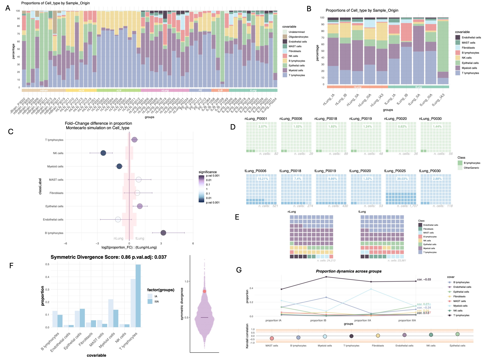
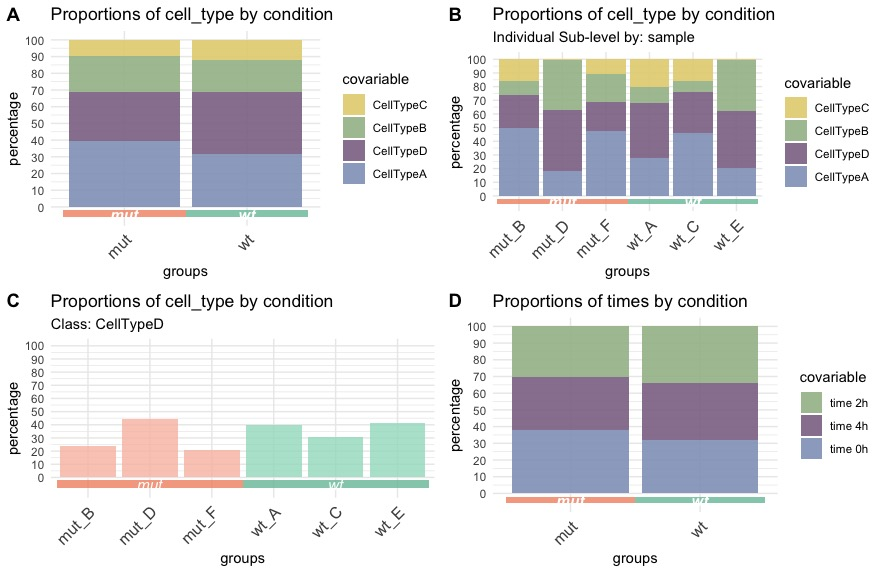
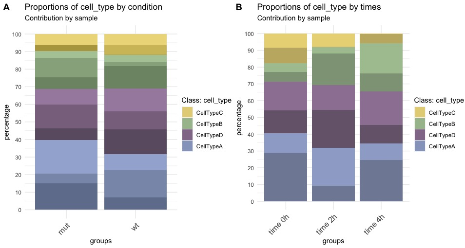
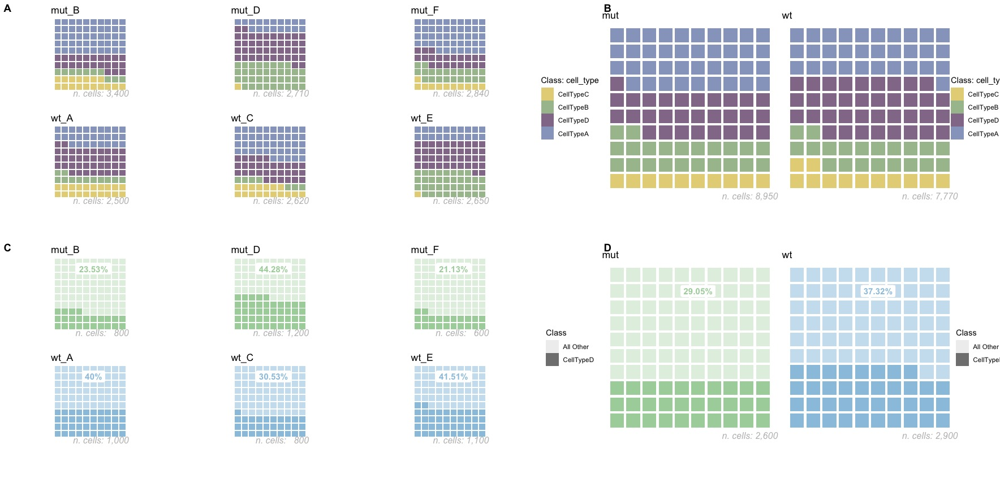
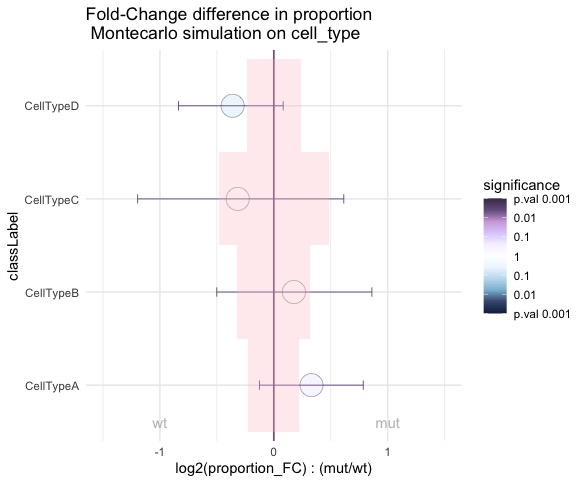
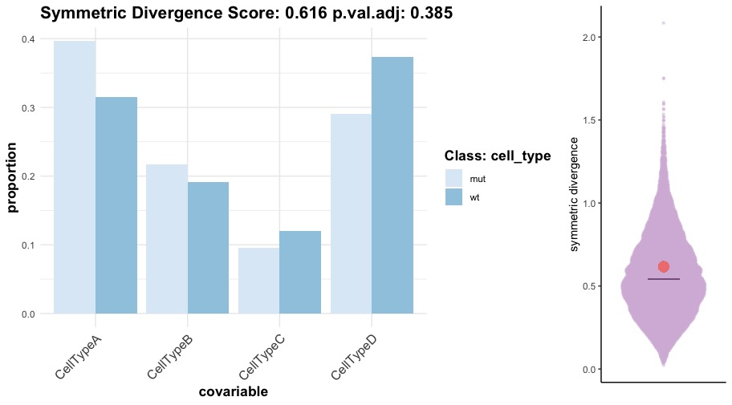
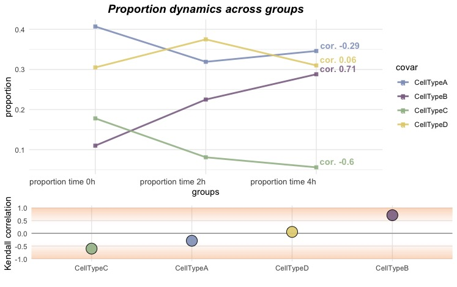

# Lot Of Cells

Proportion test statistics and visualization on single cell metadata. A simple package for single cell metadata exploration.

### Installation

The package can be installed from R software using devtools:

```{r eval=FALSE}
library(devtools)
install_github("OscarGVelasco/lotOfCells")
```

### How to cite

A pre-print is available with the details of the statistical test performed by the package and some examples of real use on a public lung adenocarcinoma dataset:

```
Óscar González-Velasco; LotOfCells: data visualization and statistics of single cell metadata. bioRxiv 2024.05.23.595582; doi: https://doi.org/10.1101/2024.05.23.595582
```

# Introduction

Single cell sequencing unveils a treasure trove into the biological and molecular characteristics of samples. Here we introduce `LotOfCells`: a simple R package designed to explore the intricate landscape of phenotype data within single-cell studies. An archetypal example of such analysis would be to test the differences in proportion between cell-types across conditions, but it can be used in many scenarios e.g: test if a specific cell-type or class proportion is dependent of sequencing date as a quality check.

### Overview of tests and visualizations available in LotOfCells

<figure>

<figcaption><i><b>Diagram of plots and tests available in LotOfCells. A.</b> Barplots of proportions of cell types for all individual samples from different tissues, the tissue class is depicted in the colored boxes on the x-axis. <b>B.</b> Barplots showing the cell type composition of normal and tumor lung samples, each bar corresponds to a cancer stage. Samples from the same stage-condition are grouped together in the same bar. <b>C.</b> Montecarlo test for the difference in cell type population abundances between tumor and normal lung samples in stage IA. B lymphocyte population is significantly larger in tumor. <b>D.</b> Waffle plots showing B lymphocytes only for all independent patients. The number of total B lymphocytes is depicted in grey. Each square=1\%. <b>E.</b> Waffle plot showing IA stage for tumor and normal lung. All samples are pulled together by condition. <b>F.</b> Symmetric divergence score test between stages IA and IIIA from lung tumor. On the right a scatter violin plot showing the distribution of generated scores vs the observed value. <b>G.</b> Cell type proportion changes across cancer stages in lung tumor. Values of the Kendall Tau correlation coefficient per cell type are shown. <b>H.</b> Barplot of Myeloid cells proportions across cancer stages in lung tumor. <b>I.</b> Polar plot showing the raw number of cells per tissue. </i></figcaption>
</figure>

# Manual

`LotOfCells` is compatible with `Seurat` and `SingleCellExperiment` objects. It is also possible to directly provide a dataframe with the metadata.
All functions require the following inputs:

-   `scObject`: Either and object of class `Seurat` or of class `SingleCellExperiment`, or a dataframe containing the metadata.
-   `main_variable`: Column name containing the main class variable condition we want to test and visualize (e.g.: condition, treatment, tissue...). 
-   `subtype_variable`: Column name containing the subtype class variable we want to test and visualize (e.g. cell type, sequencing date, cluster...). 
-   `sample_id`: (optional) Column name containing the sample/patient id variable. If provided, for tests sampling will be done simulating the proportion variability per sample, for plots each individual will be shown.

### Examples

We will construct a simulated dataset of single cell metadata made up of 6 samples, with two conditions (mutant and wild type) including 4 cell types (A,B,C,D) and different time points simulating treatment (time 0h/2h/4h):

```{r construct}

# # Data simulation with 2 conditions, 3 time points, and 4 cell-types:
sample1 <- c(rep("CellTypeA",700),rep("CellTypeB",300),rep("CellTypeC",500),rep("CellTypeD",1000))
sample2 <- c(rep("CellTypeA",1700),rep("CellTypeB",350),rep("CellTypeC",550),rep("CellTypeD",800))
sample3 <- c(rep("CellTypeA",1200),rep("CellTypeB",200),rep("CellTypeC",420),rep("CellTypeD",800))
sample4 <- c(rep("CellTypeA",500),rep("CellTypeB",1000),rep("CellTypeC",10),rep("CellTypeD",1200))
sample5 <- c(rep("CellTypeA",550),rep("CellTypeB",990),rep("CellTypeC",10),rep("CellTypeD",1100))
sample6 <- c(rep("CellTypeA",1350),rep("CellTypeB",590),rep("CellTypeC",300),rep("CellTypeD",600))
sample <- c(rep("A",length(sample1)),rep("B",length(sample2)),rep("C",length(sample3)),rep("D",length(sample4)),rep("E",length(sample5)),rep("F",length(sample6)))
times <- c(rep("time 0h",length(sample1)),rep("time 0h",length(sample2)),rep("time 2h",length(sample3)),rep("time 2h",length(sample4)),rep("time 4h",length(sample5)),rep("time 4h",length(sample6)))
cell_type <- c(sample1, sample2, sample3, sample4, sample5, sample6)
meta.data <- data.frame(sample, cell_type, times)
meta.data$condition <- "wt"
meta.data[meta.data$sample %in% c("B","D","F"),]$condition <- "mut"
rownames(meta.data) <- as.character(1:nrow(meta.data))
head(meta.data)

```

First, lets visualize the data using LotOfCells. In these functions, we can also specify:

-   `subtype_only`: Visualize only a specific class from `subtype_variable`. Useful if for example you only want to show the proportions of a specific cell type or subclass.

### Barplots

Barplots are displayed is such order that the class with the largest average proportion is always at the bottom, facilitating the comparison of smaller groups at the top. 

`LotOfCells` can be used with any other combination of variables (different from cell type). Here (Figure D), by switching the `subtype_variable` to the time-points we can investigate the contribution of time-points to the main condition, serving as a quality check to understand the weight of some covarites to the target condition (e.g. time points, sequencing dates or different tissues):

```{r, eval=False }

# # Test of barplot charts:
# All cells together for every group:
g.A <- bar_chart(meta.data, main_variable = "condition", subtype_variable = "cell_type")
# Barplot for each individual sample:
g.B <- bar_chart(meta.data, main_variable = "condition",subtype_variable = "cell_type", sample_id = "sample")
# Display One-Class only:
g.C <- bar_chart(meta.data, main_variable = "condition",subtype_variable = "cell_type", sample_id = "sample", subtype_only = "CellTypeD")
# Distribution of time-points by condition:
g.D <- bar_chart(meta.data, main_variable = "condition",subtype_variable = "times")

ggpubr::ggarrange(g.A, g.B, g.C, g.D, labels = c("A", "B", "C","D"),  
          ncol=2, nrow=2, common.legend = F)

```

<figure>

<figcaption><i> Example barplots. </i></figcaption>
</figure>

### Contribution of a class to the global population in barplots

If we want to visualize the contribution to the global proportion of a specific class (e.g.: how much each sample contribute to each cell type proportion), we can use the `contribution = TRUE` flag when setting the `sample_id` variable:

```{r}

# Examine the contribution of each sample to the proportions of cell types per condition:
g.A <- bar_chart(meta.data, main_variable = "condition",subtype_variable = "cell_type", sample_id = "sample", contribution = TRUE)
# Examine the contribution of each sample to the proportions of cell types per time point:
g.B <- bar_chart(meta.data, main_variable = "times",subtype_variable = "cell_type", sample_id = "sample", contribution = TRUE)

ggpubr::ggarrange(g.A, g.B, labels = c("A", "B"),
                  ncol=2, nrow=1, common.legend = F)
```

<figure>

<figcaption><i> Example barplots with contribution per class. </i></figcaption>
</figure>

### Waffles

To visualize small proportions using waffle plots might be more advisable:

```{r}
# # Test of Waffles charts:
# All cells together for every group
g.A <- waffle_chart(meta.data, main_variable = "condition",subtype_variable = "cell_type")
# Waffle for each individual sample:
g.B <- waffle_chart(meta.data, main_variable = "condition",subtype_variable = "cell_type", sample_id = "sample")
# One-Class only:
g.C <- waffle_chart(meta.data, main_variable = "condition",subtype_variable = "cell_type", sample_id = "sample",subtype_only = "CellTypeD")

ggpubr::ggarrange(ggpubr::ggarrange(g.B, g.C, nrow=2, labels = c("A","B")), g.A, labels = c("", "C"),  
                  ncol=2, nrow=1, widths = c(2,1))
```

<figure>

<figcaption><i> Example waffle plots. </i></figcaption>
</figure>

### Polar plots

Lastly, this visualization might be interesting to compare raw number of cells per class (e.g.: if a sample has a much larger number of cells, which might affect downstream analysis).

```{r}
# Test of circle polar plot:
polar_chart(meta.data, main_variable = "condition",subtype_variable = "cell_type", sample_id = "sample")
# Test of polar plot by cell-type:
polar_chart(meta.data, main_variable = "cell_type",subtype_variable = "sample")
```

### Parallelization

For the proportion tests and the Montecarlo simulations that we are going to introduce, we can use parallelization using `BiocParallel`:

```{r}
# Set number of CPUs to use:
BiocParallel::register(BPPARAM =  BiocParallel::MulticoreParam(workers = 6))
```

### Differential proportion test - two conditions

The main feature of LotOfCells is the test of differences in proportions, and a simulation of a random distribution to understand how extreme our observations might be. To compare the proportions of a specific class between 2 conditions we have to define the two classes and the order in which they will be compared from the column specified in `main_variable`. Optionally we can set the sample_id column (or other sub-class level) to include the per-sample heterogeneity in the computational simulation.

***NOTE: for significance testing we recommend an $\alpha$ value of 0.001**

A plot of the differences in proportions is printed (pink shades correspond to the sd of the Montecarlo simulations), and a dataframe with the statistical results is returned.

```{r}
# # Test of 2 conditions using montecarlo and differences in percentage
labelOrder <- c("mut","wt")
results.2.conditions <- lotOfCells(scObject = meta.data,
                                      main_variable = "condition",
                                      subtype_variable = "cell_type",
                                      sample_id = "sample",
                                      permutations = 1000,
                                      labelOrder = labelOrder,
                                      parallel = TRUE)
print(results.2.conditions)
```

<figure>

<figcaption><i> Test of differences in proportion. </i></figcaption>
</figure>

### Symmetric Divergence Score - global disregulation in class proportions

To understand if the majority of class proportions change significantly at the same time for two conditions, we compute a divergence score based on the Kullback-
Leibler (KL) divergence. We simulate a random distribution to try to understand how extreme is the observed symmetric score.

```{r}
# # Test of entropy for 2 conditions using montecarlo simulation
labelOrder <- c("mut","wt")
results.2.conditions.entropy <- entropyScore(scObject = meta.data,
          main_variable = "condition",
          subtype_variable = "cell_type",
          permutations = 10000,
          labelOrder = labelOrder,
          parallel = TRUE)
```

<figure>

<figcaption><i> Test of symmetric entropy score in global proportions. </i></figcaption>
</figure>

### Differential proportion test - more than two conditions

The test of differences in proportions available in LotOfCells can be done with more than 2 conditions, by computing a Kendall rank correlation coefficient. To compare the proportions of a specific class between several conditions we will need to define the classes and the order in which they will be compared from the column specified in `main_variable`, the correlation (positive and negative) will be tested following the order defined. Optionally, like introduced above, we can set the sample_id column (or other sub-class level) to include the per-sample heterogeneity in the computational simulation.

```{r}
# # Test of correlation for SEVERAL conditions using Kendall rank correlation
labelOrder <- c("time 0h","time 2h","time 4h")
results.3.conditions <- lotOfCells(scObject = meta.data,
                                main_variable = "times",
                                subtype_variable = "cell_type",
                                sample_id = "sample",
                                permutations = 1000,
                                labelOrder = labelOrder,
                                parallel = TRUE)
head(results.3.conditions)
dynamics_chart(gammaResults = results.3.conditions)
```

<figure>

<figcaption><i> LotOfCells proportion test with more than 2 conditions. </i></figcaption>
</figure>
