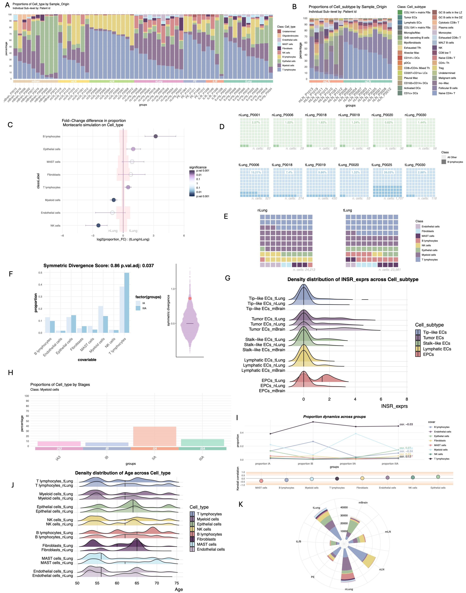

# Lot Of Cells

Proportion test statistics and visualization on single cell metadata. A simple package for single cell data exploration.

### Installation

The package can be installed from R software using devtools:

```{r eval=FALSE}
library(devtools)
install_github("OscarGVelasco/lotOfCells")
```

# Introduction

Single cell sequencing unveils a treasure trove into the biological and molecular characteristics of samples. Yet, within this flood of data, the challenge to draw meaningful conclusions sometimes can be hard.

Here we introduce `LotOfCells`: a simple R package designed to explore the intricate landscape of phenotypic data within single-cell studies. Normally, we are interested in measuring if the differences in the proportion of number of cells across various covariates is significant or biologically relevant. As an example, to test the proportion of different cell-types across conditions. `LotOfCells` helps with the interpretation and visualization of metadata of these recurrent scenarios.

### Overview of test and visualizations available in LotOfCells




# Examples

We will construct a simulated dataset of single cell metadata, including cell types (A,B,C,D) and different time points simulating treatment (time 0h - time 4h):

```{r construct }
# # Data simulation with 4 conditions and 4 cell-types:
sample1 <- c(rep("CellTypeA",700),rep("CellTypeB",300),rep("CellTypeC",500),rep("CellTypeD",1000))
sample2 <- c(rep("CellTypeA",1700),rep("CellTypeB",350),rep("CellTypeC",550),rep("CellTypeD",800))
sample3 <- c(rep("CellTypeA",1200),rep("CellTypeB",200),rep("CellTypeC",420),rep("CellTypeD",800))
sample4 <- c(rep("CellTypeA",500),rep("CellTypeB",1000),rep("CellTypeC",10),rep("CellTypeD",1200))
sample5 <- c(rep("CellTypeA",550),rep("CellTypeB",990),rep("CellTypeC",10),rep("CellTypeD",1100))
sample <- c(rep("A",length(sample1)),rep("B",length(sample2)),rep("C",length(sample3)),rep("D",length(sample4)),rep("E",length(sample5)))
times <- c(rep("time 0h",length(sample1)),rep("time 1h",length(sample2)),rep("time 2h",length(sample3)),rep("time 3h",length(sample4)),rep("time 4h",length(sample5)))
covariable <- c(sample1, sample2,sample3,sample4,sample5)
meta.data <- data.frame(sample, covariable, times)
meta.data$condition <- "wt"
meta.data[meta.data$sample %in% c("C","D"),]$condition <- "mut"
sample_id="sample"
main_variable="condition"
rownames(meta.data) <- as.character(1:nrow(meta.data))
head(meta.data)
```

First, lets visualize the data using LotOfCells:

```{r construct }
# # # Test of Waffles charts:
waffle_chart(meta.data, main_variable = "condition",subtype_variable = "covariable", sample_id = "sample")
# All cells together for every group
waffle_chart(meta.data, main_variable = "condition",subtype_variable = "covariable")
# One-Class only:
waffle_chart(meta.data, main_variable = "condition",subtype_variable = "covariable", sample_id = "sample",subtype_only = "CellTypeD")
# # Test of barplot charts:
bar_chart(meta.data, main_variable = "condition",subtype_variable = "covariable", sample_id = "sample")
# # One-Class only:
bar_chart(meta.data, main_variable = "condition",subtype_variable = "covariable", sample_id = "sample", subtype_only = "CellTypeD")
# Test of circle polar plot:
polar_chart(meta.data, main_variable = "condition",subtype_variable = "covariable", sample_id = "sample")
# Test of polar plot by cell-type:
polar_chart(meta.data, main_variable = "covariable",subtype_variable = "sample")
```
